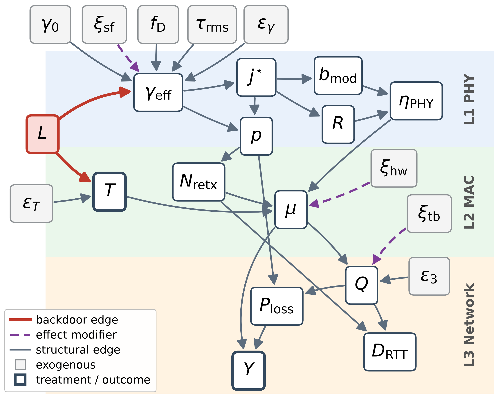
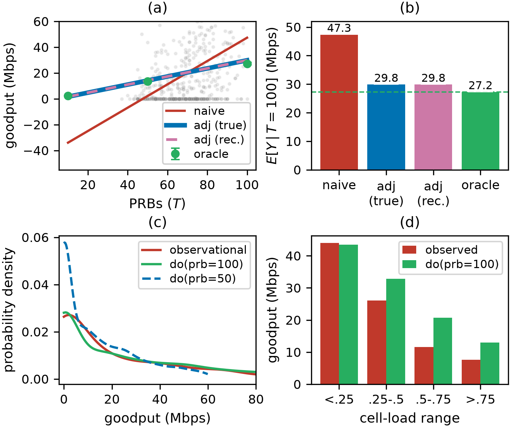
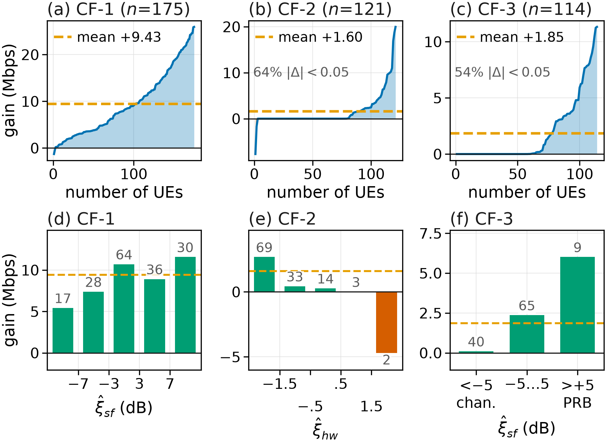
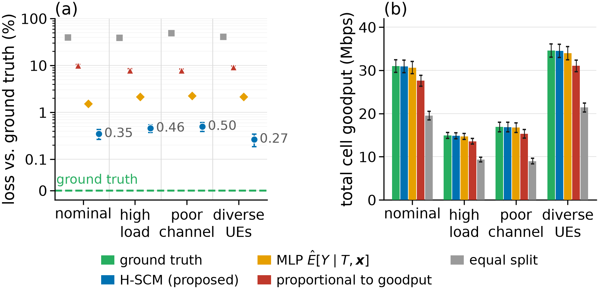

# hscm-ran

Code, data and results for

> **From Confounding to Counterfactuals: A Cross-Layer Causal Model for RAN Scheduling**
> Artin Elhamirad, Christo Kurisummoottil Thomas (Worcester Polytechnic Institute),
> Ali Tajer (Rensselaer Polytechnic Institute)

A hierarchical structural causal model (H-SCM) spanning the PHY, MAC and network
layers of a single-cell downlink RAN separates cell-load confounding from UE-specific
response heterogeneity. A counterfactual scheduling problem selects PRB allocations
from per-UE counterfactual goodput rather than observational conditional averages,
and is solved by a pipeline of constrained causal discovery, structural-equation
fitting, and abduction–action–prediction. Every number and figure in the paper is
produced by the scripts in `experiments/` from the configuration in `config/` and is
read from a file in `results/`.

## The model (paper Sections II–III)

Each endogenous variable is determined by a structural equation
V_i = f_i(Pa(V_i), U_i). The variables are partitioned by protocol layer with no edges
from a higher to a lower layer (Fig. 1). Paper notation on the left, column name in
the code on the right.

| layer | equation | column |
|---|---|---|
| L1 PHY | γ_eff = γ₀ + ξ_sf − β_L L − Δ_D(f_D) − Δ_τ(τ_rms) + ε_γ  (1) | `sinr_eff` |
| | j* = highest-rate MCS with BLER(γ_eff, j) ≤ target; b_mod, R from the MCS table; η_PHY = b_mod R; p = BLER(γ_eff, j*) | `mcs_idx`, `mod_order`, `code_rate`, `se_phy`, `bler` |
| L2 MAC | T = min{N_PRB, max{1, ⌊N_PRB(1 − α_L L)⌋ + ε_T}}  (2) | `num_prb` (the treatment) |
| | E[N_retx] = Σ_{k=1}^{K_H} p^k  (3) | `harq_retx` |
| | μ: MAC service rate from T, η_PHY, HARQ overhead and the device-specific RF term ξ_hw | `mac_tput` |
| L3 network | Q = [ρ² ξ_tb / (2(1 − ρ)) + ε₃]₊,  ρ = min{λ/μ, ρ_max}  (4) | `queue_dep` |
| | D_RTT = τ₀ + c_q Q/λ + τ_H E[N_retx]  (5) | `rtt_ms` |
| | P_loss = 1 − (1 − p^{1+E[N_retx]}) exp(−[Q − q_th]₊ / q_scale)  (6) | `pkt_loss` |
| | Y = μ (1 − P_loss) | `goodput` (the outcome) |

Context variables **z** = {L, γ₀, f_D, τ_rms, ξ_sf, ξ_hw, ξ_tb} (`cell_load, snr,
doppler, delay_spread, shadow_fading, hw_impairment, traffic_burst`); noise
U = {ε_γ, ε_T, ε₃} (`eps_sinr, eps_sched, eps_queue`). The DAG in
`config/dag_edges.yaml` has 23 nodes and 30 edges and is derived from the equations
above. Cell load L is a common cause of T and γ_eff — the backdoor path
T ← L → γ_eff → ⋯ → Y — while ξ_sf, ξ_hw and ξ_tb have no edge into T and act as
effect modifiers. do(T = t) replaces the mechanism of T by the constant t, severing
L → T and leaving L → γ_eff active.



### Simulation parameters (paper Table I)

| parameter | value | in the code |
|---|---|---|
| OFDM grid | 76 subcarriers, 15 kHz spacing, 14 symbols | `config/simulator.yaml: phy` |
| Coding and MCS set | LDPC, 512 information bits; 12 MCSs | `phy.ldpc_info_bits`, `mcs_table` |
| BLER target / HARQ limit | 0.1 / 3 retransmissions | `phy.target_bler`, `mac.harq_max_rounds` |
| PRB and load parameters | N_PRB = 100, α_L = 0.58, β_L = 18 dB | `mac.base_prb`, `mac.alpha_L`, `sinr.beta_L` |
| Offered traffic / utilization cap | 5.5 Mbps / ρ_max = 0.95 | `network.arrival_mbps`, `network.rho_max` |
| Queue-loss parameters | q_th = 5, q_scale = 10 | `network.q_thr`, `network.q_scale` |

The physical layer is Sionna 1.2 with the 3GPP CDL-C channel at 2.6 GHz, a fixed
delay spread of 100 ns and a UE speed of 3 m/s. The simulated MCS-specific BLER curves
(`data/bler_lut.npz`) determine the highest-rate MCS satisfying the BLER target at
each UE's effective SINR.

## The pipeline (paper Section III-C)

1. **Causal discovery** (`causal/discovery.py`, `causal/protocol_knowledge.py`,
   `causal/mediator_test.py`; `experiments/step11_protocol_discovery.py`). The PC
   algorithm learns a skeleton from the 17 observable telemetry variables; edge
   directions are restricted by protocol-layer and within-layer processing order and
   the remaining edges are oriented with DirectLiNGAM; regression on pooled
   observational and interventional data proposes additional edges, admitted in
   significance order while preserving acyclicity; candidate edges are then checked
   with simulator interventions that hold the mediator set fixed (paper eq. 11, both
   arms on identical exogenous draws), and an edge is retained only when a significant
   effect remains after mediator blocking.
2. **Structural-equation fitting** (`causal/fitting.py`). Each mechanism is a
   gradient-boosting machine (200 trees, maximum depth 4, learning rate 0.05, paper
   eq. 12). Telemetry fits use the observable parents in the recovered graph; oracle
   fits additionally include the unit-specific structural parents, for verification
   only. Residuals are obtained by cross-fitting.
3. **Counterfactual inference** (`causal/counterfactual.py`). Abduction infers each
   UE's exogenous state from its factual telemetry by inverting the fitted mechanisms;
   action replaces the PRB mechanism with T = t; prediction evaluates the fitted
   mechanisms in topological order, re-applying each UE's abducted residual by the
   mechanism-specific rule (additive for most mechanisms, multiplicative for the MAC
   service rate, rescaling of the traffic-dependent residual component of the queue
   backlog; hardware normalization do(ξ_hw = 0) sets the MAC residual multiplier to one).
4. **Counterfactual scheduling** (paper eq. 10; `scheduler/causal_scheduler.py`,
   `experiments/step15_alloc_by_env.py`). Per-UE counterfactual goodput tables are
   maximised under the shared PRB budget by exact search.

## Results reported in the paper

**Causal discovery** (`results/step11_per_seed.csv`, `results/step11_recovered_dag.yaml`).
Discovery runs on the 17 observable telemetry variables, which contain 24 of the
DAG's 30 edges; the six latent variables (ξ_sf, ξ_hw, ξ_tb, ε_γ, ε_T, ε₃) and their
outgoing edges are excluded from discovery and its evaluation. Each run uses 500
observational and 2940 interventional samples, plus 2000 paired UE realizations per
mediator-testing contrast. Across 50 independent realizations the pipeline recovers
22 of the 24 observable edges with no false positives: precision 1.000, recall 0.917,
F1 0.957.

**Structural fitting and held-out counterfactuals** (`results/cf_oracle_validation.csv`).
Models are fitted on 500 observational samples. On 5000 held-out UEs the per-UE
counterfactual predictions reach R² = 0.979, 0.988 and 0.994 against the simulator's
per-UE outcomes under do(T = 50), do(T = 100) and hardware normalization do(ξ_hw = 0).

**Fig. 2 — confounding analysis** (`results/rung2_dose_response.csv`,
`results/step13_phase6.csv`). Naive OLS regression of Y on T alone predicts a mean
goodput of 47.34 Mbps at T = 100, exceeding the simulator's ground-truth mean of
27.25 Mbps under the same intervention by 73.7 %. Including L in the regression
reduces the estimate to 29.85 Mbps and the relative error to 9.5 %. The recovered and
reference graphs yield identical estimates because both identify L as the required
adjustment variable. Mean interventional goodput is 2.32, 13.56 and 27.25 Mbps at
T = 10, 50 and 100.



**Fig. 3 — counterfactual queries** (`results/step13_phase7.csv`,
`results/step13_strata.csv`, `results/step13_cf_arrays.npz`).

| query | selection | n | mean goodput | gain |
|---|---|---|---|---|
| CF-1: what goodput would UEs with moderate factual goodput have attained under do(T = 100)? | 5 ≤ Y ≤ 40 Mbps | 175 | 19.47 → 28.90 Mbps | +9.43 (+48.4 %) |
| CF-2: what goodput would UEs underperforming their peers have attained at nominal hardware, do(ξ_hw = 0)? | MAC throughput below 95 % of the median among peers with the same MCS and PRB decile | 121 | 13.65 → 15.25 Mbps | +1.60 (+11.7 %) |
| CF-3: what goodput would UEs with nominal SNR γ₀ ∈ [10, 20] dB and factual Y < 15 Mbps have attained under do(T = 100)? | γ₀ ∈ [10, 20] dB, Y < 15 Mbps | 114 | 3.46 → 5.32 Mbps | +1.85 (+53.5 %) |

By inferred residual range: in CF-1 the mean gain is 5.43 Mbps for the most
channel-limited UEs and 11.56 Mbps for the most favorable; in CF-2 gains concentrate
among UEs with below-nominal hardware quality while UEs with above-nominal quality
lose goodput when normalized; in CF-3 channel-limited UEs gain 0.10 Mbps on average
against 6.00 Mbps for PRB-limited UEs. The mean gain alone cannot identify which UEs
benefit from additional PRBs.



**Fig. 4 — counterfactual scheduling under environment shift**
(`results/step15_alloc_by_env.csv`). Four UEs (K = 4) share the cell's PRB budget with
at least 10 PRBs per UE. The H-SCM and a multilayer perceptron (MLP) trained on
identical data optimize their predicted goodput by exact search, and allocations are
evaluated in the simulator against an oracle using true counterfactuals. Models are
trained once under nominal conditions and tested without refitting in four
environments (nominal; high load; poor channel; diverse UEs — `experiments/step15_alloc_by_env.py`
defines the shifted root distributions) over 50 realizations. The mean relative loss
in realized total cell goodput against the oracle allocation is 0.27–0.50 % for the
H-SCM, 1.5–2.3 % for the MLP, 8–10 % for allocation proportional to observed goodput,
and 39–49 % for equal splitting.



## Reproduce

```bash
conda create -n hscm-ran python=3.11 -y && conda activate hscm-ran
pip install -r requirements.txt           # sionna 1.2.2, tensorflow 2.21, causal-learn, lingam, ...

python experiments/build_bler_lut.py                      # MCS-specific BLER curves (reuses data/bler_lut.npz)
python experiments/step3_generate_datasets.py             # 500 observational + 19 x 30 interventional samples
python experiments/build_oracle_validation.py --n 5000    # 5000 held-out UEs with their true counterfactuals
python experiments/step6_rung12.py                        # naive / adjusted / ground-truth estimates at T = 100
python experiments/step7_counterfactuals.py               # held-out R^2 under do(T=50), do(T=100), do(xi_hw=0)
python experiments/step11_protocol_discovery.py --seeds 50    # causal discovery, 50 realizations -> results/step11_recovered_dag.yaml
python experiments/step13_phase67_recovered.py            # estimates and CF-1/2/3 on the recovered graph
python experiments/step15_alloc_by_env.py --seeds 50 --cells 25  # scheduling in four environments
python experiments/plot_dag.py                            # Fig. 1 -> results/figures/fig1_dag.png
python experiments/plot_confounding_recovered.py          # Fig. 2 -> results/figures/fig2_confounding.png
python experiments/plot_cf_effects.py                     # Fig. 3 -> results/figures/fig3_counterfactual_gains.png
python experiments/plot_alloc_by_env.py                   # Fig. 4 -> results/figures/fig4_scheduling.png
python -m pytest tests/
```

All numpy-driven artifacts are seeded (seed 42 for the canonical run; the 50
realizations use seeds 42–91) and regenerate bit-for-bit. The BLER table
`data/bler_lut.npz` is committed and is the table every result uses;
`build_bler_lut.py` reuses it whenever its configuration fingerprint matches.
Rebuilding it from scratch draws a fresh Monte-Carlo sample.

Verified on macOS arm64 (CPU) with Sionna 1.2.2 / TensorFlow 2.21.
